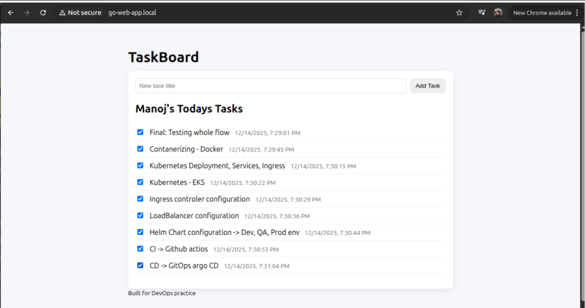
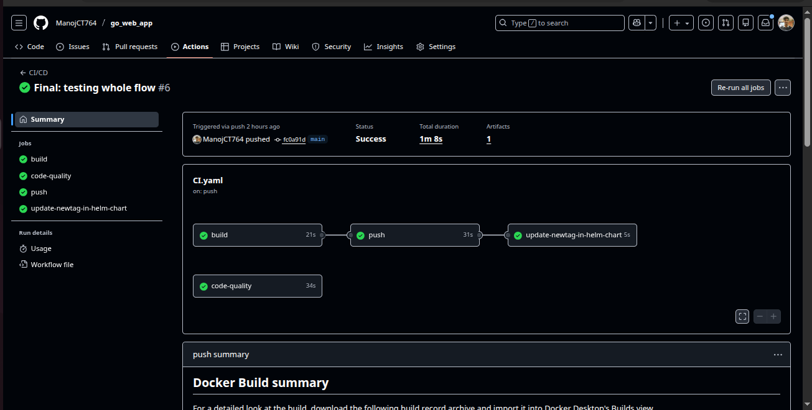
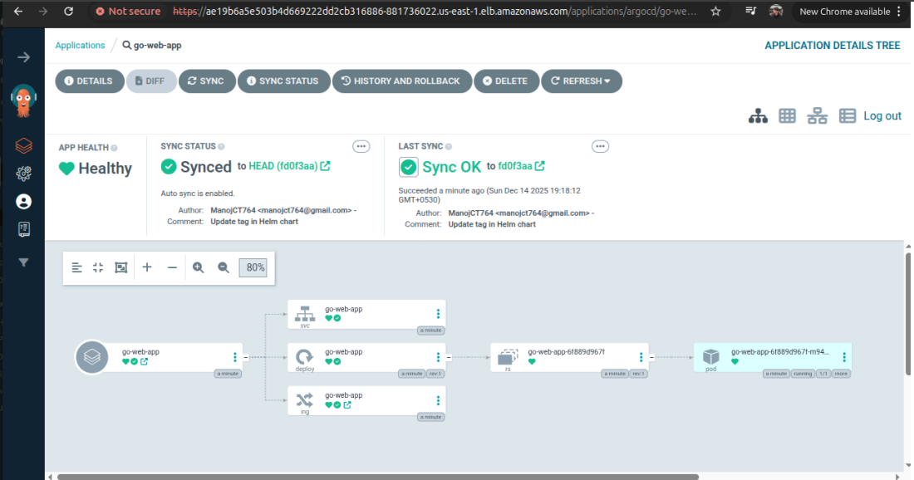

# TaskBoard

A minimal Go web application built using the standard library.  
This project is mainly used to practice **DevOps concepts** such as containerization, CI/CD, Kubernetes, Helm, and GitOps.

---

## 📌 Project Overview

This is a hands-on DevOps implementation for a Go-based web application.

The goal of this project was to understand and implement a **complete DevOps workflow** — starting from containerization and CI, moving to Kubernetes deployments, GitOps-based CD, ingress handling, and finally proper cleanup to avoid cloud costs.

This project was built incrementally while experimenting, breaking things, fixing them, and learning how real-world DevOps setups behave.

---

## 🧰 Tech Stack

- **Language**: Go
- **Containerization**: Docker (multi-stage build)
- **CI**: GitHub Actions
- **CD / GitOps**: Argo CD
- **Container Registry**: Docker Hub
- **Orchestration**: Kubernetes (Amazon EKS)
- **Packaging**: Helm
- **Ingress Controller**: NGINX Ingress
- **Cloud Provider**: AWS

---

## 🐳 Docker – Containerization

The application is containerized using a **multi-stage Dockerfile**.

### Approach
- Build the Go binary in the first stage
- Run the binary using a minimal runtime image in the final stage

### Why multi-stage?
- Smaller image size
- Reduced attack surface
- Faster container startup

---

## 🔄 CI – GitHub Actions


A CI pipeline is implemented using GitHub Actions.

### What the pipeline does
- Checkout the source code
- Set up the Go environment
- Build the application
- Run unit tests
- Run static code analysis using `golangci-lint`
- Build and push the Docker image to Docker Hub
- Update the Helm chart image tag automatically

Linting is treated as a **quality gate**, not just an optional step.

---

## ☸️ Kubernetes – Amazon EKS

The Kubernetes cluster was created using `eksctl`.

### Cluster configuration
- **Instance type**: `t3.small`
- **Node count**: 2
- **Region**: `us-east-1`

This setup was chosen to balance **cost and stability** while learning.

---

## 🌐 Ingress & Networking

An **NGINX Ingress Controller** was installed to manage external access to the application.

### Key points
- Ingress class verified as `nginx`
- Controller watches application ingress resources
- Application exposed using an AWS LoadBalancer

Access was restricted using a hostname:


Local DNS entries were added for testing.

---

## 📦 Helm Charts

A custom Helm chart was created for the application.

### What was done
- Removed default Helm templates
- Added custom:
  - Deployment
  - Service
  - Ingress
- Configured `values.yaml` for image details and environment values

The application was installed and tested using Helm to understand the full lifecycle.

---

## 🚀 CD – GitOps with Argo CD

Argo CD was installed using official manifests.


### Purpose
- Practice GitOps-based deployments
- Observe automatic sync between Git and cluster state
- Deploy Helm chart updates automatically

The Argo CD UI was exposed temporarily using a LoadBalancer **only for learning purposes**.

---

## 🔁 End-to-End Flow

1. Update application code or static content
2. Push changes to GitHub
3. CI pipeline triggers automatically
4. Docker image is rebuilt and pushed
5. Helm chart image tag is updated
6. Argo CD syncs the change to the cluster


---

## 🧹 Cleanup & Cost Awareness

After completing the practice, all AWS resources were cleaned up.

```bash
eksctl delete cluster --name demo-cluster --region us-east-1
